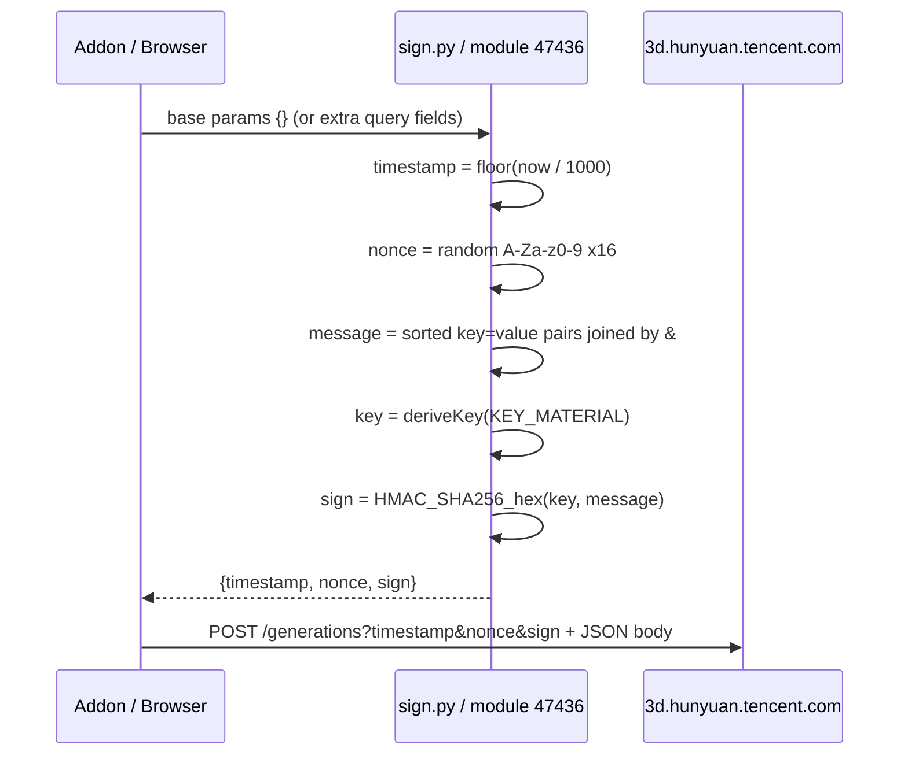

# Hunyuan 3D Web API: Signing Investigation & Algorithm Reference

This document records how the `timestamp`, `nonce`, and `sign` query parameters for  
`POST /api/3d/creations/generations` were discovered, reverse-engineered, verified, and reimplemented in this addon (`api/h3d/sign.py`).

---

## Part 1 — Investigation: How the signing logic was found

### 1.1 Starting point: a broken addon vs. a working browser request

The addon’s text-to-3D path called:

```
POST https://3d.hunyuan.tencent.com/api/3d/creations/generations
```

with a JSON body only (no query string). The user captured a **working** browser request that differed in several ways:

| Aspect | Old addon | Browser (May 2026) |
|--------|-----------|---------------------|
| URL | No query params | `?timestamp=…&nonce=…&sign=…` |
| `modelType` | `modelCreationV2.5` | `text2ModelV3.1` |
| `faceCount` | absent | `1500000` |
| Response | (assumed same) | `{"creationsId":"…"}` |

The presence of `sign` in the URL was the strongest clue that **request authentication had moved from “cookies + headers only” to “signed query string + cookies + headers”**. The signature was not a Tencent Cloud `TC3-HMAC-SHA256` header (that uses `Authorization`, `X-TC-Timestamp`, etc.) — it was a **custom, short hex digest** in the query string, which implied client-side logic embedded in the web app’s JavaScript.

### 1.2 Repository search (no prior art)

A search inside this repo for `sign`, `nonce`, and `timestamp` returned **no matches**. Other Hunyuan API modules (`detail.py`, `list.py`, `config.py`) also did not sign requests. So the signing code had to be **added from scratch**, not patched from an older internal implementation.

Public GitHub / documentation searches for `3d.hunyuan.tencent.com` + `sign` + `nonce` did not surface a ready-made Python port. The official Tencent Cloud Hunyuan 3D API uses a different auth scheme entirely (SecretId/SecretKey, `TC3-HMAC-SHA256`).

**Conclusion:** Reverse-engineer the live web frontend.

### 1.3 Fetching the web app shell and locating JS bundles

The homepage was downloaded with `curl`:

```
https://3d.hunyuan.tencent.com/
```

The HTML is a standard SPA shell. Script tags pointed at hashed bundles on the CDN, for example:

| Bundle | Role (inferred) |
|--------|------------------|
| `utils__98a6d963a73f89a32aed.js` | Utilities (large; includes COS SDK noise) |
| `tencent-sdk__262fabcfbce40a8fc040.js` | Tencent SDK |
| `index__7333e4d0e6fd1123b5f0.js` | Main application / API layer |
| `2392__52f75da60dd673f26911.js` | Additional chunks |

Initial grep in `utils__*.js` hit many unrelated `sign` strings (COS `q-sign-algorithm`, axios, etc.), not the Hunyuan 3D API signer.

### 1.4 Keyword search in the main `index` bundle

Searching `index__7333e4d0e6fd1123b5f0.js` for API-specific strings yielded high-signal hits:

**Generations endpoint + `signature: true` flag**

```javascript
l = (0, r.A)(((e, t) =>
  n.g.post(`${n.m}/api/3d/creations/generations`, e, {
    headers: { ...t },
    signature: true   // <-- interceptor enables signing
  })
))
```

This proved:

1. The path is still `/api/3d/creations/generations`.
2. Signing is **not** manual at each call site — an HTTP client wrapper reads `signature: true` and injects query parameters before `POST`.

**Model type enum**

```javascript
e.modelCreationV3_1_Text = "text2ModelV3.1"
```

Matches the user’s payload `modelType`.

**Face count enum**

```javascript
e[e.faceCountinitV3 = 15e5] = "faceCountinitV3"  // 1_500_000
```

Matches `faceCount: 1500000` in the user capture.

### 1.5 Locating the signer module by searching for `nonce`

A second pass searched for `nonce` near offset ~105000 in the same bundle. That landed on **webpack module `47436`**, which exports:

- `l` → random nonce string (`n3` export)
- `s` → Unix timestamp (`mI` export)
- `p` → full sign builder (`Xv` export)

Extracted surrounding code (beautified for readability):

```javascript
// Module 47436 — signing helpers
function l(e = 16) {
  let t = "";
  for (let o = 0; o < e; o++)
    t += "ABCDEFGHIJKLMNOPQRSTUVWXYZabcdefghijklmnopqrstuvwxyz0123456789"
      .charAt(Math.floor(62 * Math.random()));
  return t;
}

function s() {
  return Math.floor(Date.now() / 1e3);
}

const c = new Uint8Array([122, 59, 92, 165, 30, 79, 166, 139, 142, 129, 139, 89, 219, 131, 101, 204]);
const d = new Uint8Array([122, 59, 92, 45, 30, 79, 106, 139, 156, 13, 46, 63, 74, 91, 108, 125]);
const u = new Uint8Array([3, 5, 2, 7, 1, 4, 6, 2, 5, 3, 1, 4, 2, 6, 3, 5]);
const m = [14, 11, 13, 9, 15, 10, 12, 8, 6, 3, 5, 1, 7, 2, 4, 0];

function p(e, t) {
  const {
    nonceLength: o = 16,
    timestampField: n = "timestamp",
    nonceField: a = "nonce",
    signField: p = "sign",
  } = t;
  const g = { ...e };
  g[n] = s();
  g[a] = l(o);
  const h = sortAndStringify(g);           // entries -> "k=v&..."
  const y = HmacSHA256(h, deriveKey(c)).toString(hex);
  g[p] = y;
  return g;
}
```

The inline `deriveKey` function (named `v` in the minified source) XORs, rotates, permutes, then decodes bytes until the first `0x00` — that string becomes the **HMAC key**.

`i()` and `r()` in the minified call are the CryptoJS-style **`HmacSHA256`** and **hex output** helpers from other webpack chunks (`69956`, `3793`).

### 1.6 Confirming scope: which endpoints use signing?

Searching the entire `index` bundle for `signature:!0` (i.e. `signature: true`) found **only one** API call:

- `POST /api/3d/creations/generations`

Other endpoints used in the addon (`/api/3d/creations/detail`, `/api/3d/creations/list`, `/api/3d/config`) do **not** set `signature: true` in the web app. That matches keeping `detail.py` unsigned.

### 1.7 Verification against the user’s captured request

The user provided a known-good triple:

```
timestamp = 1779354450
nonce     = MX84JdqVcqZSIkht
sign      = e281d746af5f0193bf9cc8e3f7d4b709cb59aacc41290316d3612f4b08c33038
```

Reimplementing the algorithm in Python:

1. Derive HMAC key from constant `c` → string **`Hf6d6KFB3D`** (10 bytes).
2. Build message from sorted params **excluding `sign`**:
   ```
   nonce=MX84JdqVcqZSIkht&timestamp=1779354450
   ```
3. `HMAC-SHA256(key, message)` → hex.

**Result: exact match** with the browser `sign`. This closed the loop — no guesswork on hash algorithm, sort order, or key derivation remained.

### 1.8 Implementation in the addon

| File | Purpose |
|------|---------|
| `api/h3d/sign.py` | Portable reimplementation |
| `api/h3d/generations.py` | `signed_url()` + updated payload |
| `ops/session.py` | Added `hy_user` cookie (seen in browser jar) |

### 1.9 Investigation tools summary

| Step | Tool / method |
|------|----------------|
| Download SPA HTML | `curl.exe` |
| List / grep bundles | PowerShell `Select-String`, Python `re.finditer` |
| Extract function bodies | Python slice by byte offset in minified file |
| Validate algorithm | Python `hmac` + `hashlib.sha256` |
| Cross-check API surface | Grep `signature:!0`, `creations/generations`, `text2ModelV3` |

---

## Part 2 — How the signing algorithm works

### 2.1 Overview

When the web app (or this addon) calls a **signature-protected** endpoint, it augments the URL with three query parameters:

```
timestamp  — Unix time in seconds (integer, sent as decimal string)
nonce      — 16 random alphanumeric characters
sign       — lowercase hex HMAC-SHA256 digest
```

Signing happens **before** the HTTP request is sent. The `sign` parameter is computed from `timestamp` and `nonce` only (plus any other non-empty params passed into the signer object — for generations, the signer starts from `{}`).

Cookies (`hunyuan_token`, `hunyuan_user`, …) and headers (`x-product`, `x-source`, `trace-id`, …) are **separate**; they identify the user but do not replace the query signature.

### 2.2 End-to-end flow (diagram)



### 2.3 Step 1 — Generate `timestamp`

```python
timestamp = str(int(time.time()))  # Unix seconds, no milliseconds
```

Same as JS `Math.floor(Date.now() / 1000)`. The server likely rejects stale timestamps (typical skew window: a few minutes); the addon generates a fresh value per request.

### 2.4 Step 2 — Generate `nonce`

```python
nonce = "".join(secrets.choice(ALPHABET) for _ in range(16))
# ALPHABET = A-Z a-z 0-9 (62 characters)
```

Properties:

- Fixed length **16** (configurable via `nonceLength` in JS, default 16).
- **Uniform** choice from 62 characters (JS uses `Math.random()`, we use `secrets` for better entropy in the addon).
- Purpose: replay protection and request uniqueness together with `timestamp`.

### 2.5 Step 3 — Build the canonical message string

All parameters that will appear in the query string **except `sign`** are collected into a map, then:

1. Drop entries where value is `null` or `""`.
2. Coerce every value with `str()`.
3. Sort by key using **lexicographic (locale) string order** — `localeCompare` in JS ≈ ASCII sort for these keys.
4. Join as `key=value` pairs with `&`.

For the default generations call the map is only:

```
{ "timestamp": "<ts>", "nonce": "<nonce>" }
```

Sorted keys → `nonce` before `timestamp`:

```
nonce=<nonce>&timestamp=<timestamp>
```

**Important:** `sign` is **not** included in the message. It is appended only after the HMAC is computed.

If the signer were ever called with extra query fields (e.g. `?foo=bar`), those would be merged into the map **before** sorting, and all non-empty values would participate in the HMAC input.

### 2.6 Step 4 — Derive the HMAC secret key from embedded material

The web app does **not** use the user’s cookie or token as the HMAC key. Instead it uses a **fixed 16-byte constant** `c` obfuscated into a short string `v`:

#### Constants (from webpack module 47436)

| Symbol | Meaning | Bytes |
|--------|---------|-------|
| `c` | Key material | `[122, 59, 92, 165, 30, 79, 166, 139, 142, 129, 139, 89, 219, 131, 101, 204]` |
| `d` | XOR mask | `[122, 59, 92, 45, 30, 79, 106, 139, 156, 13, 46, 63, 74, 91, 108, 125]` |
| `u` | Per-byte rotation amounts (left rotate) | `[3, 5, 2, 7, 1, 4, 6, 2, 5, 3, 1, 4, 2, 6, 3, 5]` |
| `m` | Permutation indices | `[14, 11, 13, 9, 15, 10, 12, 8, 6, 3, 5, 1, 7, 2, 4, 0]` |

#### Sub-step A — XOR

For each index `i` in `0..15`:

```
t[i] = c[i] XOR d[i]
```

#### Sub-step B — Left rotate each byte

For each index `i`, rotate `t[i]` left by `u[i]` bits (8-bit wrap):

```
o[i] = ((t[i] << u[i]) | (t[i] >> (8 - u[i]))) & 0xFF
```

#### Sub-step C — Permute positions

```
n[i] = o[m[i]]
```

#### Sub-step D — Truncate at first zero byte

Find the first index `r` where `n[r] == 0`. If none, `r = 16`.  
The HMAC key is the UTF-8/Latin-1 string of `n[0:r]`.

For the shipped constants, `r = 10` and the key is the ASCII string:

```
Hf6d6KFB3D
```

This obfuscation is **security through obscurity**: anyone who downloads the public JS bundle (or this document) can sign requests. It mainly prevents casual unsigned scraping, not determined reverse engineering.

### 2.7 Step 5 — Compute `sign`

```python
sign = hmac.new(
    key=derived_key_bytes,      # b"Hf6d6KFB3D"
    msg=canonical_string.encode(),
    digestmod=hashlib.sha256,
).hexdigest()   # 64 lowercase hex chars
```

Matches CryptoJS `HmacSHA256(message, key).toString(Hex)` in the browser.

### 2.8 Step 6 — Attach query string and send POST

Final URL pattern:

```
https://3d.hunyuan.tencent.com/api/3d/creations/generations
  ?timestamp=<ts>&nonce=<nonce>&sign=<hex>
```

The **JSON body** (`prompt`, `modelType`, `faceCount`, etc.) is **not** part of the HMAC input in the current web implementation — only the query parameters handled by the signer are. (If the server also validated the body, the browser would include it in the signed string; the successful reproduction without body data proves it does not for this endpoint.)

### 2.9 Worked example (from captured traffic)

**Inputs**

| Field | Value |
|-------|-------|
| `timestamp` | `1779354450` |
| `nonce` | `MX84JdqVcqZSIkht` |

**Canonical message**

```
nonce=MX84JdqVcqZSIkht&timestamp=1779354450
```

**Derived HMAC key (bytes → ASCII)**

```
Hf6d6KFB3D
```

**Signature**

```
e281d746af5f0193bf9cc8e3f7d4b709cb59aacc41290316d3612f4b08c33038
```

**Full URL (excerpt)**

```
POST .../generations?timestamp=1779354450&nonce=MX84JdqVcqZSIkht&sign=e281d746...
```

### 2.10 Python reference implementation

The addon implementation lives in `hunyuan3d_blender/api/h3d/sign.py`:

- `build_signed_query_params()` — returns `{timestamp, nonce, sign}`
- `signed_url(base_url)` — appends URL-encoded query string
- `generations.py` calls `signed_url(GENERATIONS_URL)` before `session.post(...)`

### 2.11 Operational notes for maintainers

| Topic | Guidance |
|-------|----------|
| **Bundle updates** | Tencent may change `c`, `d`, `u`, `m`, or the algorithm in a new `index__*.js` deploy. If signed requests return 403, re-run the investigation on the new bundle. |
| **Endpoint scope** | Only `generations` used `signature: true` at time of writing. Re-grep after frontend updates. |
| **Clock skew** | Use accurate system time; NTP drift beyond server tolerance will fail validation. |
| **Cookies still required** | Signing does not replace `hunyuan_token` / `hunyuan_user` session cookies. |
| **Do not log secrets** | The derived key is static and public-equivalent; still treat cookies as secrets. |

### 2.12 What this is *not*

- **Not** Tencent Cloud API `TC3-HMAC-SHA256` (no `Authorization` header, no SecretId in query).
- **Not** COS `q-sign-algorithm=sha1` upload signing (different product, found in `utils__*.js`).
- **Not** bound to the JSON payload fields — body changes do not alter `sign` unless the web client changes that behavior in a future version.

---

## Appendix A — Related payload changes (same API update)

Documented alongside signing for completeness:

```json
{
  "sceneType": "playGround3D-2.0",
  "count": 4,
  "modelType": "text2ModelV3.1",
  "prompt": "...",
  "title": "...",
  "style": "",
  "faceCount": 1500000,
  "enable_pbr": true,
  "enableLowPoly": false
}
```

Response:

```json
{ "creationsId": "f6fa33d9-32e4-4d26-99d1-fcc35d623855" }
```

---

## Appendix B — CDN bundle URLs (May 2026)

Captured from `https://3d.hunyuan.tencent.com/`:

```
https://cdn-3d-prod.hunyuan.tencent.com/public/index__7333e4d0e6fd1123b5f0.js
```

Module of interest: webpack chunk exporting `47436` (`Xv`, `mI`, `n3`).

---

*Document version: 2026-05-21 — matches addon `api/h3d/sign.py` implementation.*
